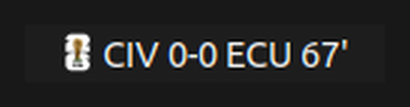

# ⚽ Soccer Ticker

Live soccer scores in your **Linux top bar** or **macOS menu bar**. It shows the
score of an in-progress match and rotates through all of them; the dropdown
lists every live game with its competition, scorers, cards, stats, form, and odds.

Data comes from **ESPN's free public scoreboard API** — real-time, **no API key
or signup required**.



*The tray icon is the live match's competition logo (here, the FIFA World Cup),
followed by the score and clock. It rotates through all in-progress matches.*

```
┌─ Top bar ───────────────────────────┐
│ Activities   ⚽ CIV 0-0 ECU 40'  🔋 🔊 │
└─────────────────────────────────────┘
        click ▾
        ⚽ CIV 0 - 0 ECU   40'
              World Cup
        ─────────────────
        Updated 23:42:07
        Refresh now
        ─────────────────
        Quit
```

Runs on **Linux** (GTK AppIndicator in the GNOME/KDE top bar) and **macOS**
(native menu-bar app). Both share the same data core; only the front-end differs.

## Linux

### 1. Install dependencies

```bash
sudo apt install python3-gi gir1.2-gtk-3.0 gir1.2-ayatanaappindicator3-0.1
pip3 install --user requests        # usually already present
```

On Ubuntu GNOME, tray icons are shown by the **Ubuntu AppIndicators**
extension, which ships and is enabled by default. On vanilla GNOME, install the
[AppIndicator Support](https://extensions.gnome.org/extension/615/appindicator-support/)
extension.

### 2. Run

```bash
python3 -m soccer_ticker      # from the repo root
```

The indicator appears in the top bar. When nothing is live it shows the **next
match kicking off within 24h** (e.g. `IRQ v NOR 15:00`); with no upcoming match
either, it shows just the icon. If the network is down it shows `offline`.

### 3. Start automatically on login (optional)

```bash
cp soccer-ticker.desktop ~/.config/autostart/
```

(The bundled `.desktop` assumes the project lives in `~/git/soccer-ticker`.
Adjust the `Path=` line if you cloned it elsewhere.)

## macOS

### 1. Install dependencies

Requires Python 3 (the system `python3`, or one from [python.org](https://www.python.org/)
/ Homebrew). Then install the two Python packages:

```bash
pip3 install requests rumps
```

`rumps` is the menu-bar framework; it pulls in PyObjC automatically.

### 2. Run

```bash
git clone https://github.com/nickndeng/soccer-ticker.git
cd soccer-ticker
python3 -m soccer_ticker
```

The score appears in the **menu bar** with the competition logo as the icon,
and it rotates through all live matches. Click it for the full match list
(scorers, cards, stats, form, odds, venue, TV). When nothing is live it shows
the next match within 24h, or just the soccer icon if there's none.

### 3. Start automatically on login (optional)

Create a `launchd` agent at `~/Library/LaunchAgents/com.soccer-ticker.plist`
(replace both paths to match your Python and clone location):

```xml
<?xml version="1.0" encoding="UTF-8"?>
<!DOCTYPE plist PUBLIC "-//Apple//DTD PLIST 1.0//EN"
  "http://www.apple.com/DTDs/PropertyList-1.0.dtd">
<plist version="1.0">
<dict>
    <key>Label</key>            <string>com.soccer-ticker</string>
    <key>ProgramArguments</key>
    <array>
        <string>/usr/bin/python3</string>
        <string>-m</string>
        <string>soccer_ticker</string>
    </array>
    <key>WorkingDirectory</key> <string>/Users/YOU/path/to/soccer-ticker</string>
    <key>RunAtLoad</key>        <true/>
</dict>
</plist>
```

Then load it:

```bash
launchctl load ~/Library/LaunchAgents/com.soccer-ticker.plist
```

(Prefer a GUI? [`lingon`](https://www.peterborgapps.com/lingon/) manages login
items without editing plists.)

## Configuration (optional)

By default it watches the World Cup, Champions League, and the top five European
leagues + MLS. To change that, drop a config file at
`~/.config/soccer-ticker/config.json` (see `config.example.json`) with a
`leagues` list of ESPN league slugs, e.g.:

```json
{ "leagues": [["fifa.world", "World Cup"], ["eng.1", "Premier League"]] }
```

Other ESPN slugs include `eng.2` (Championship), `ned.1` (Eredivisie),
`por.1` (Primeira Liga), `bra.1` (Brasileirão), `uefa.europa`, `mex.1`.

The config file lives at `~/.config/soccer-ticker/config.json` on Linux and
`~/Library/Application Support/soccer-ticker/config.json` on macOS.

## Project layout

```
soccer_ticker/
  core.py            # ESPN client, match model, logo cache — no GUI deps
  frontend_linux.py  # GTK3 AppIndicator (top bar)
  frontend_macos.py  # rumps menu-bar app (NSStatusItem)
  __main__.py        # picks the front-end by platform
```

All the data logic is in `core.py`; the front-ends only render it, so a fix in
one place benefits both platforms.

## Notes

- Polls every 30s across the watched leagues. ESPN's API is undocumented but
  public and free; there's no published rate limit, but keep the league list
  reasonable.
- Live matches (state `in`, including half-time) are shown first. When none are
  live, it falls back to the soonest match kicking off within the next 24h, and
  to just the icon if there's nothing in that window.
- A failure on one league is ignored; the label only shows `offline` if
  every league request fails.
- Why not football-data.org? Its free tier does **not** provide real-time
  in-play status — a World Cup match 40 minutes in still reported as
  "scheduled". ESPN's feed updates live.

## License

This project is licensed under
[**Creative Commons Attribution-NonCommercial-ShareAlike 4.0 International**](https://creativecommons.org/licenses/by-nc-sa/4.0/)
(CC BY-NC-SA 4.0) — see [`LICENSE`](LICENSE). In short, you may use, share, and
modify it **for non-commercial purposes**, as long as you give credit and
release any derivatives under the same terms.

Note: this is a *source-available* license, not an OSI-approved "open source"
one — the non-commercial restriction is intentional.

### Commercial licensing

The non-commercial terms above do **not** permit commercial use. As the
copyright holder, the author offers separate **commercial licenses** for use in
commercial products or services — contact nickndeng@gmail.com to arrange one.
(Contributions via pull request are accepted under a Contributor License
Agreement so the project can continue to be dual-licensed.)

### Third-party content

This license covers the application's own source code only. Match data comes
from ESPN's public API and competition/team **logos are trademarks of their
respective owners**, fetched at runtime and not redistributed in this
repository.
